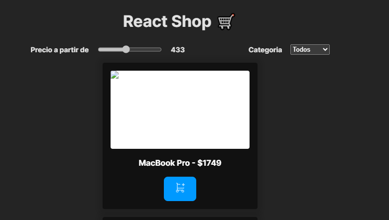
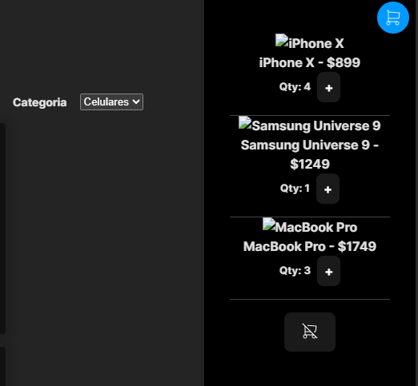

# Carrito de compras con React

Este proyecto es una aplicación desarrollada en React para simular un carrito de compras y sus respectivos filtros. 

## Contenidos

- [Requisitos](#requisitos)
- [Instalación](#instalación)
- [Despliegue Local](#despliegue-local)
- [Capturas de Pantalla](#capturas-de-pantalla)

## Requisitos

Para ejecutar este proyecto, necesitas tener instalado:

- Node.js (versión 14 o superior)
- npm (versión 6 o superior) o yarn (opcional)

## Instalación

1. Clona el repositorio en tu máquina local:

    ```bash
    git clone https://github.com/pauldev24/Cart-Ecommerce.git
    cd Cart-Ecommerce
    ```

2. Instala las dependencias del proyecto:

    Con npm:
    ```bash
    npm install
    ```

    Con yarn:
    ```bash
    yarn install
    ```

## Despliegue Local

Para ejecutar el proyecto en tu entorno local, utiliza el siguiente comando:

Con npm:
```bash
npm run dev
```

## Capturas de Pantalla

